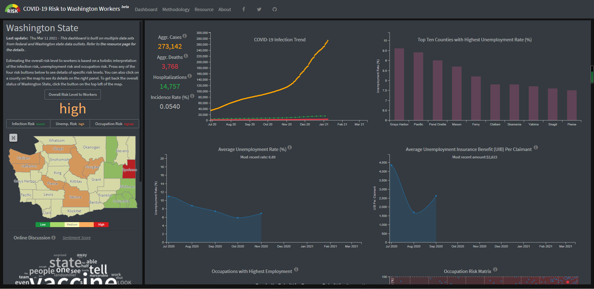

# COVID-19 Risk to Washington Workers Smart Dashboard Analysis

By [Yuke Cao](https://www.linkedin.com/in/yuke-cao-261838191/)

## Project Description

### Goals

This smart dashboard provides specific information about occupational risk factors and a county level COVID and unemployment assessment. It is built to enable local governments, communities, and workplaces to enact locally appropriate health- and economic-protective policies for workers during this period of economic recovery

### Authors

This dashboard is made by [Bo Zhao](https://github.com/jakobzhao), a geography professor at the University of Washington and the Principal Investigator at [Humanistic GIS Laboratory](https://hgis.uw.edu/), with other members in HGIS Lab: Marissa Baker, Kim England, Ellie Cleasby, Fengyu Xu, Jou Ho, Xiaoqi Bao, Kyle Roland, Yuke Cao in 2020. This project is funded by the Population Health Initiative at University of Washington (UW), School of Public Health, Department of Geography and the Harry Bridges Center for Labor Studies; Hosted upon the server offered by UW's Center for Studies in Demography and Ecology (CSDE); Maintained by the UW's Humanistic GIS Laboratory. For more details about this project, visit the website of smart dashboard [COVID-19 Risk to Washington Workers](https://hgis.uw.edu/covid19-workers).

### Functions

The following are the main functionalities of this smart dashboard.
- A clickable map that allows user to navigate through different counties' risk in Washington State. The map contains four different features in different colors to estimate the overall risk level to workers is based on a holistic interpretation of the infection risk, unemployment risk and occupation risk.
- A zoom bar that allows users to zoom to the original map.
- The color scale to shows the risk level.
- A word could that be generated from the recent Twitter posts which contains 'covid' as a keyword.
- Each county has six graphics to show the different risk information.
  - The COVID-19 Infection Trend is shown as time-series graph. It has the aggregate infected COVID-19 confirmed cases, the aggregate deaths caused by the COVID-19, the number of patients who have been hospitalized and the incidence rate.
  - The Average unemployment Rate and Average Unemployment Insurance Benefit (UIB) Per Claimant also changed by clicking different counties. The data is also represented by dot plot.
  - The Top Ten Counties with Highest Unemployment Rate is listed by bar graph.
  - The Occupations with Highest Employment are listed on next to Occupation Risk Matrix which is shown as scatterplot.
- A methodology page that contains the brief explanation of the methods they use to design this dashboard.
- A resource page that lists all the sources.
- An about page that has the overall information of the dashboard.

### Data Sources

- Sources
  - Labor Force by County Snapshot
  - Unemployment Insurance Claims and Benefits
  - O*NET data arranged by Exposure to disease/infection at work
  - O*NET data arranged by Works in physical proximity at work
  - Coronavirus Outbreak
  - ACS Data

- External Tools and Libraries
  - Bootstrap
  - leaflet
  - c3
  - d3
  - simplebar
  - easy-button
  - font-awesome
  - jQuery
  - rbush
  - labelgun
  - topojson
  - tweepy
  - nltk, VADER
  - wordcloud

## Systematic architecture
